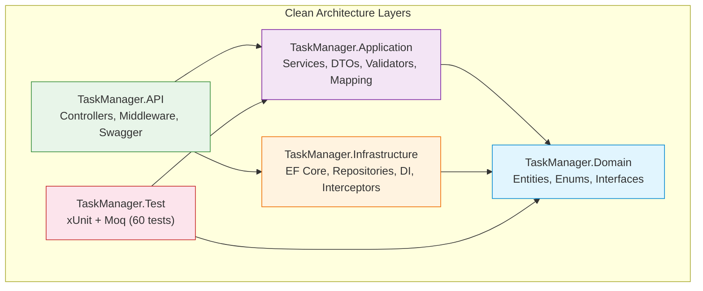
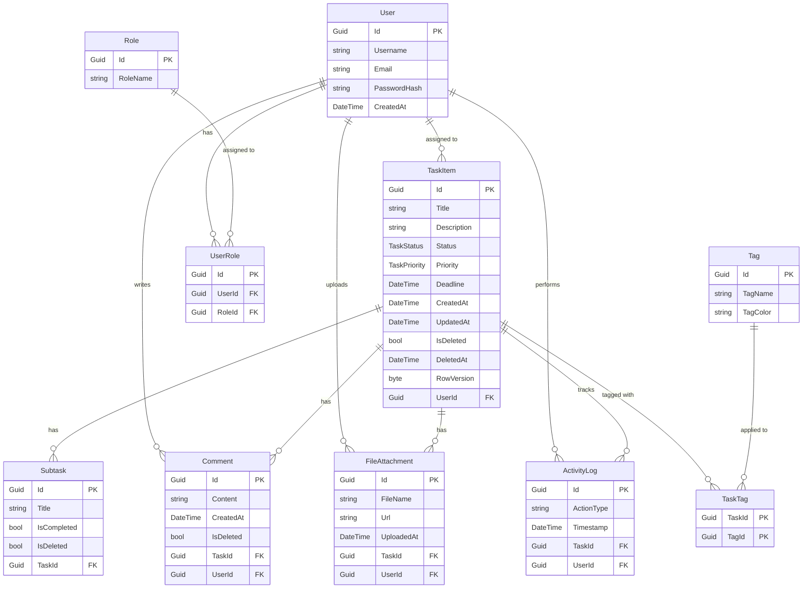
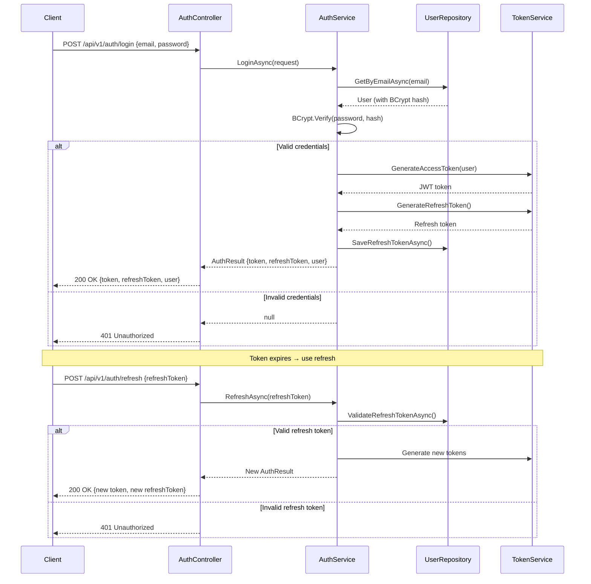

# Task Manager App

A full-stack task management application built with **ASP.NET Core 9 Web API** (Clean Architecture) and **React 19** frontend. Created as a practical sandbox for testing backend architecture, data modeling, and design patterns in real code — evolved into a complete full-stack application with authentication, CRUD operations, Kanban board, analytics, and more.

---

## Architecture Overview



**Core rule:** inner layers do not depend on outer layers. Domain has zero external dependencies.

### Database Schema (ER Diagram)



### Authentication Flow



---

## Features

### Backend
- **Clean Architecture** (Domain, Application, Infrastructure, API, Tests)
- **JWT authentication** with BCrypt password hashing and refresh tokens
- **Password change** endpoint with current password verification
- **User profile update** (username, email)
- **Domain-Driven Design**: entity factory methods, encapsulated state transitions, soft delete
- **Unit of Work** pattern with `IUnitOfWork`
- **EF Core** with PostgreSQL, Fluent API configuration
- **Soft delete** with query filters (TaskItem, Comment, Subtask)
- **Optimistic concurrency** control (RowVersion on TaskItem)
- **Pagination and filtering** for tasks
- **Task assignment** to users
- **Activity log** endpoint for tracking task changes
- **API versioning** (URL segment: `api/v1/...`)
- **Automatic activity logging** via SaveChanges interceptor
- **Rate limiting** (token bucket, 100 req/min per IP)
- **Response caching** on tasks (30s) and users (60s) endpoints
- **FluentValidation** for all DTOs
- **AutoMapper** for entity-to-DTO mapping
- **Serilog** structured logging (Console + File sinks)
- **Global exception handling** middleware
- **Swagger/OpenAPI** with XML comments and JWT Bearer scheme
- **CORS** and **health checks** configured
- **DB seeding** on startup (admin/demo users, roles, sample tasks)
- **Unit tests**: 60 tests (xUnit + Moq + AutoMapper)

### Frontend
- **React 19** + TypeScript + TailwindCSS + Vite
- JWT-based authentication with protected routes and refresh token support
- Dashboard with task grid, search, filter chips, and table/list view toggle
- Task detail page with inline editing, subtasks, comments, and markdown rendering
- Kanban board with drag & drop between status columns
- Analytics page with task statistics and progress bars
- CSV export for tasks
- Profile page with edit profile and change password functionality
- Dark mode with CSS variables and localStorage persistence
- Toast notifications for all CRUD operations
- Responsive layout with Lucide icons

---

## Tech Stack

### Backend
| Technology | Version | Purpose |
|------------|---------|---------|
| ASP.NET Core | 9 | Web API framework |
| C# / .NET | 9 | Language / runtime |
| PostgreSQL | 16 | Database |
| EF Core | 9 | ORM |
| AutoMapper | 15.1.3 | Entity-to-DTO mapping |
| FluentValidation | 12.1.0 | Input validation |
| Serilog | 9.0.0 | Structured logging |
| Asp.Versioning.Mvc | 8.1.0 | API versioning |
| BCrypt.Net-Next | 4.0.3 | Password hashing |
| xUnit + Moq | latest | Unit testing |

### Frontend
| Technology | Version | Purpose |
|------------|---------|---------|
| React | 19 | UI framework |
| TypeScript | 5.x | Type safety |
| TailwindCSS | 3 | Utility-first styling |
| Vite | 7 | Build tool / dev server |
| React Router | 7 | Client-side routing |
| Lucide React | latest | Icons |
| react-markdown | latest | Markdown rendering |

---

## API Endpoints

All endpoints are prefixed with `api/v1/`. Authentication requires `Authorization: Bearer <JWT>` header.

| Method | Endpoint | Description | Auth |
|--------|----------|-------------|------|
| **Auth** ||||
| POST | `/auth/login` | Login with email + password | No |
| POST | `/auth/refresh` | Refresh access token | No |
| **Tasks** ||||
| POST | `/tasks` | Create a new task | Yes |
| GET | `/tasks` | Get all tasks (with optional pagination/filters) | Yes |
| GET | `/tasks/{id}` | Get task by ID | Yes |
| PUT | `/tasks/{id}` | Update task | Yes |
| DELETE | `/tasks/{id}` | Delete task (soft delete) | Yes |
| POST | `/tasks/{id}/assign/{userId}` | Assign task to user | Yes |
| GET | `/tasks/{id}/activity` | Get activity log for task | Yes |
| **Subtasks** ||||
| POST | `/subtasks` | Create subtask | Yes |
| GET | `/subtasks/{id}` | Get subtask by ID | Yes |
| GET | `/subtasks/task/{taskId}` | Get all subtasks for a task | Yes |
| PUT | `/subtasks/{id}` | Update subtask | Yes |
| DELETE | `/subtasks/{id}` | Delete subtask (soft delete) | Yes |
| **Comments** ||||
| POST | `/comments` | Create comment | Yes |
| GET | `/comments/{id}` | Get comment by ID | Yes |
| GET | `/comments/task/{taskId}` | Get all comments for a task | Yes |
| PUT | `/comments/{id}` | Update comment | Yes |
| DELETE | `/comments/{id}` | Delete comment (soft delete) | Yes |
| **Users** ||||
| GET | `/users` | Get all users | Yes |
| GET | `/users/{id}` | Get user by ID | Yes |
| POST | `/users` | Create user | No |
| PUT | `/users/{id}` | Update user | Yes |
| PUT | `/users/{id}/profile` | Update user profile | Yes |
| POST | `/users/{id}/change-password` | Change password | Yes |
| DELETE | `/users/{id}` | Delete user | Yes |
| **Roles** ||||
| GET | `/roles` | Get all roles | Yes |
| GET | `/roles/{id}` | Get role by ID | Yes |
| POST | `/roles` | Create role | Yes |
| PUT | `/roles/{id}` | Update role | Yes |
| DELETE | `/roles/{id}` | Delete role | Yes |
| **Tags** ||||
| GET | `/tags` | Get all tags | Yes |
| GET | `/tags/{id}` | Get tag by ID | Yes |
| POST | `/tags` | Create tag | Yes |
| DELETE | `/tags/{id}` | Delete tag | Yes |
| **Task Tags** ||||
| POST | `/task-tags/{taskId}/{tagId}` | Add tag to task | Yes |
| DELETE | `/task-tags/{taskId}/{tagId}` | Remove tag from task | Yes |
| GET | `/task-tags/task/{taskId}` | Get tags for a task | Yes |
| **User Roles** ||||
| POST | `/user-roles/{userId}/{roleId}` | Assign role to user | Yes |
| DELETE | `/user-roles/{userId}/{roleId}` | Remove role from user | Yes |
| GET | `/user-roles/user/{userId}` | Get roles for a user | Yes |
| **Activity Logs** ||||
| GET | `/activity-logs/task/{taskId}` | Get activity logs for a task | Yes |
| GET | `/activity-logs/user/{userId}` | Get activity logs for a user | Yes |
| **File Attachments** ||||
| POST | `/attachments` | Upload attachment | Yes |
| GET | `/attachments/{id}` | Get attachment by ID | Yes |
| GET | `/attachments/task/{taskId}` | Get attachments for a task | Yes |
| DELETE | `/attachments/{id}` | Delete attachment | Yes |

> For detailed request/response schemas, see [docs/api.md](docs/api.md).

---

## Project Structure

```
TaskManagerSolution/
├── TaskManagerProject/
│   ├── TaskManager.Domain/              # Entities, enums, interfaces
│   │   ├── Entities/                    # TaskItem, User, Subtask, Comment, etc.
│   │   ├── Enums/                       # TaskStatus, TaskPriority
│   │   └── Interfaces/                  # IRepository, IUnitOfWork, IService contracts
│   ├── TaskManager.Application/         # Services, DTOs, mapping, validation
│   │   ├── DTOs/                        # Data Transfer Objects (per domain area)
│   │   ├── Services/                    # Business logic (TaskService, UserService, etc.)
│   │   ├── Validators/                  # FluentValidation validators
│   │   ├── Mapping/                     # AutoMapper profiles
│   │   └── Sorting/                     # Task sorting utilities
│   ├── TaskManager.Infrastructure/      # EF Core, repositories, DI, interceptors
│   │   ├── Persistence/
│   │   │   ├── Contexts/                # ApplicationDbContext
│   │   │   ├── Configurations/          # EF Fluent API configurations
│   │   │   ├── Repositories/            # Repository implementations
│   │   │   ├── Interceptors/            # ActivityLogInterceptor
│   │   │   └── DbSeeder.cs             # Database seeding on startup
│   │   └── DependencyInjection/         # Service registration extensions
│   ├── TaskManager.API/                 # Controllers, Program.cs, middleware
│   │   ├── Controllers/                 # 11 controllers (Tasks, Auth, Users, etc.)
│   │   ├── Program.cs                   # App entry point + DI configuration
│   │   └── appsettings.json             # Configuration (secrets via User Secrets)
│   ├── TaskManager.Test/                # Unit tests (xUnit + Moq)
│   │   ├── Services/                    # Service tests (Task, User, Subtask, Comment)
│   │   ├── Controllers/                 # Controller tests (TasksController)
│   │   └── Domain/                      # Entity tests (TaskItem)
│   ├── frontend/                        # React frontend (Vite + TailwindCSS)
│   │   ├── src/
│   │   │   ├── pages/                   # Login, Dashboard, TaskDetail, Kanban, Profile
│   │   │   ├── components/              # ErrorBoundary, ConfirmDialog, Layout, etc.
│   │   │   ├── services/                # API client services
│   │   │   ├── context/                 # AuthContext, ThemeContext, ToastContext
│   │   │   └── hooks/                   # useTasks, useTask, useDebounce
│   │   └── package.json
│   └── .editorconfig                    # Code style rules
├── docs/
│   ├── overview.md                      # Project overview & architecture decisions
│   ├── api.md                           # Detailed API documentation
│   ├── future.md                        # Roadmap (6 phases)
│   ├── ideas.md                         # Extension ideas (12 detailed specs)
│   ├── refactoring-log.md               # Historical audit & refactoring record
│   └── adr/                             # Architecture Decision Records
│       ├── 001-postgresql.md
│       ├── 002-clean-architecture.md
│       ├── 003-bcrypt-password-hashing.md
│       ├── 004-automapper.md
│       ├── 005-serilog-structured-logging.md
│       └── 006-fluentvalidation.md
├── .github/workflows/ci.yml             # GitHub Actions CI/CD
├── Dockerfile.backend                   # Multi-stage .NET 9 build
├── Dockerfile.frontend                  # Node 20 + nginx
├── docker-compose.yml                   # PostgreSQL + backend + frontend
├── nginx.conf                           # SPA routing + API proxy
├── start.bat                            # One-click startup (Windows)
├── start.sh                             # One-click startup (Linux)
├── CHANGELOG.md                         # Version history
├── CONTRIBUTING.md                      # Contribution guidelines
└── README.md                            # This file
```

---

## Getting Started

### Prerequisites
- [.NET 9 SDK](https://dotnet.microsoft.com/download/dotnet/9.0)
- [PostgreSQL](https://www.postgresql.org/download/) (running on `localhost:5432`)
- [Node.js 20+](https://nodejs.org/) and npm

### Quick Start

**Windows:**
```batch
start.bat
```

**Linux:**
```bash
chmod +x start.sh
./start.sh
```

This will:
1. Restore NuGet packages
2. Build the solution
3. Start the backend API on `http://localhost:5000`
4. Install frontend dependencies and start Vite dev server on `http://localhost:3000`

### Manual Start

**Backend:**
```bash
cd TaskManagerProject
dotnet restore
dotnet build
cd TaskManager.API
dotnet run
```

**Frontend:**
```bash
cd TaskManagerProject/frontend
npm install
npm run dev
```

### Docker

```bash
docker-compose up --build
```

Services:
- PostgreSQL on `localhost:5432`
- Backend API on `localhost:5000`
- Frontend on `localhost:3000`

### Configuration
- Database connection string is in `appsettings.json` (use User Secrets for production)
- JWT secret key should be set via environment variable or User Secrets
- Frontend proxies `/api` requests to `http://localhost:5000` during development

### Seed Credentials
| User | Email | Password |
|------|-------|----------|
| Admin | `admin@taskmanager.com` | `Admin123!` |
| Demo | `demo@taskmanager.com` | `Demo123!` |

---

## Testing

```bash
# Build the solution
dotnet build TaskManagerProject\TaskManagerSolution.sln

# Run all tests
dotnet test TaskManagerProject\TaskManagerSolution.sln

# Run tests with verbose output
dotnet test TaskManagerProject\TaskManagerSolution.sln --logger "console;verbosity=detailed"
```

**Test coverage:**
- **Service tests**: TaskService, TaskServiceEdgeCases, SubtaskService, CommentService, UserService
- **Controller tests**: TasksController
- **Domain tests**: TaskItem entity (Create, ChangeStatus, MarkAsCompleted, SoftDelete)
- **Total**: 60 tests, 0 failures

---

## Documentation

- [Project Overview](docs/overview.md) — Architecture, design decisions, trade-offs
- [API Documentation](docs/api.md) — Detailed endpoint reference with schemas
- [Future Plans](docs/future.md) — 6-phase roadmap
- [Extension Ideas](docs/ideas.md) — 12 detailed feature specifications
- [Refactoring Log](docs/refactoring-log.md) — Historical audit & fix record (41 items, all completed)
- [Architecture Decision Records](docs/adr/) — ADRs for key technology choices
- [Changelog](CHANGELOG.md) — Version history
- [Contributing](CONTRIBUTING.md) — Contribution guidelines

---

## Project Type
- **Personal project** — educational / experimental
- **Full-stack** — backend + frontend
- **Architecture-driven** — Clean Architecture with DDD concepts

---

## License
This project is for educational purposes. No license is provided.
