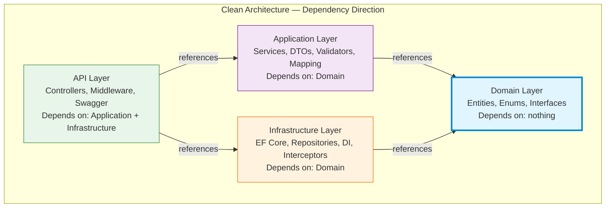
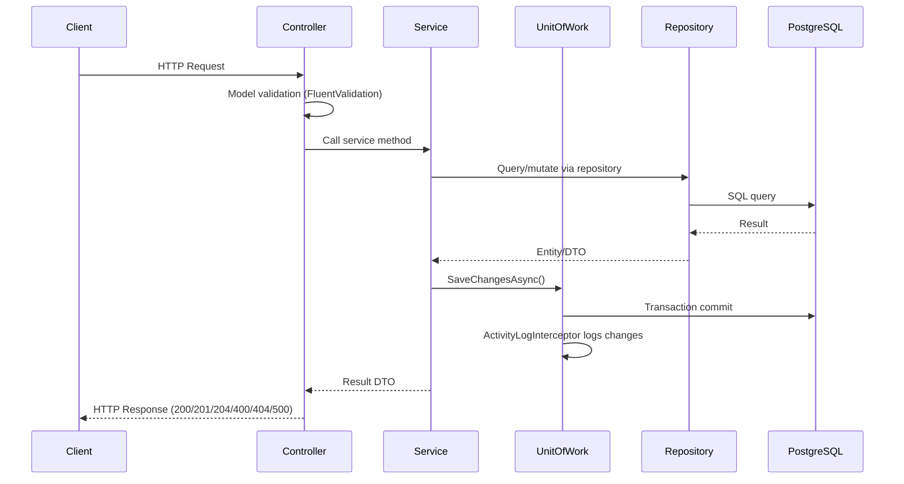
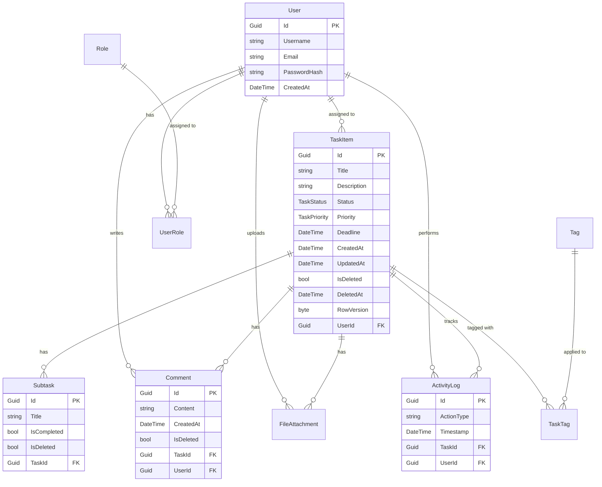

# Task Manager App — Project Overview

## Overview

Task Manager App is a backend-focused educational and experimental project created to practice new technologies, architectural approaches, and design patterns using ASP.NET Core.

The project was never intended to be a commercial or production-ready system. Its primary goal is to validate architectural ideas in real code and to understand how they behave during long-term solo development without scaffolding, generators, or shortcuts.

The repository is published publicly as a personal learning project and architectural experiment.

---

## Motivation

The idea for this project emerged during the summer as a deliberate decision to move from theory to practice.

The main motivations were:
- To experiment with new backend technologies in a controlled environment
- To apply architectural patterns that were previously studied only in theory
- To understand how backend architecture is built from scratch without relying on templates or auto-generated code
- To gain experience that can later be transferred to other languages and technology stacks

The focus was intentionally placed on structure, reasoning, and architectural decisions rather than development speed or feature count.

---

## Current State

### What Is Implemented

The project is a full-stack application with both backend and frontend:

**Backend:**
- ASP.NET Core 9 Web API with Clean Architecture
- JWT authentication with BCrypt password hashing and refresh tokens
- Password change and profile update endpoints
- Domain-Driven Design: entity factory methods, encapsulated state transitions
- Unit of Work pattern with `IUnitOfWork`
- EF Core with PostgreSQL, Fluent API configuration
- Soft delete with query filters (TaskItem, Comment, Subtask)
- Optimistic concurrency control (RowVersion on TaskItem)
- Pagination and filtering for tasks
- Task assignment to users and activity log endpoint
- API versioning (URL segment: `api/v1/...`)
- Automatic activity logging via SaveChanges interceptor
- Rate limiting and response caching
- FluentValidation for all DTOs
- AutoMapper for entity-to-DTO mapping
- Serilog structured logging
- Global exception handling middleware
- Swagger/OpenAPI with XML comments and JWT Bearer scheme
- CORS and health checks
- DB seeding on startup
- Unit tests (xUnit + Moq): 84 backend tests + 32 frontend tests

**Frontend:**
- React 19 + TypeScript + TailwindCSS + Vite
- JWT-based authentication with protected routes and refresh token support
- Dashboard with task grid, search, filter chips, and table/list view toggle
- **Full Cancelled status support** across Dashboard, Kanban (4 columns), Task Detail, Analytics, Profile
- **Full Critical priority support** with purple badge + alert icon across all pages
- Task detail page with inline editing (title, description, status, priority, deadline), subtasks, comments with author attribution, and markdown rendering
- Kanban board with drag & drop between 4 status columns (Todo, In Progress, Done, Cancelled)
- Analytics page with task statistics and progress bars (by status and priority, including Cancelled and Critical)
- CSV export for tasks (with proper field escaping)
- Profile page with edit profile, change password, task statistics (4 statuses), and recent tasks with deadlines
- Dark mode with CSS variables and localStorage persistence
- Toast notifications for all CRUD operations
- Responsive layout with Lucide icons

---

## Architecture Summary

The project is built using a simplified version of Clean Architecture with selected concepts inspired by Domain-Driven Design.

### Layer Diagram

### Layers

| Layer | Project | Responsibility | Dependencies |
|-------|---------|----------------|--------------|
| **API** | `TaskManager.API` | HTTP controllers, middleware, Swagger, DI configuration | Application, Infrastructure |
| **Application** | `TaskManager.Application` | Services, DTOs, validators, AutoMapper profiles | Domain |
| **Infrastructure** | `TaskManager.Infrastructure` | EF Core DbContext, repositories, DI extensions, interceptors | Domain |
| **Domain** | `TaskManager.Domain` | Entities, enums, interfaces (repositories, services, Unit of Work) | None |
| **Tests** | `TaskManager.Test` | Unit tests (xUnit + Moq) for services, controllers, and domain entities | Application, Domain |

**Core rule:** inner layers do not depend on outer layers. The Domain layer has zero external NuGet dependencies.

### Request Flow

---

## Database & EF Core Usage

The PostgreSQL schema was designed and created manually.

Entity Framework Core is not used to generate the database schema. Instead, it is used strictly as an ORM for:
- Mapping existing tables
- Handling data access
- Defining relationships and constraints
- Enforcing consistency between code and database

All configuration is performed using Fluent API. EF Core is treated as a tool for explicit control, not as a magic abstraction.

### Entity Relationship Diagram

---

## Key Design Decisions

### DTO and Request Models

DTOs and request models are intentionally separated.

This separation exists because:
- Client input is not the same as application data
- It provides explicit control over what the client is allowed to send
- It prevents accidental API contract changes
- It simplifies handling canceled requests and network failures

This decision emerged from practical experience rather than theoretical guidelines.

### Unit of Work

A custom Unit of Work abstraction (`IUnitOfWork`) is implemented in the Domain layer with a concrete implementation in Infrastructure.

- Services inject `IUnitOfWork` and call `SaveChangesAsync` after write operations
- Repositories no longer call `SaveChangesAsync` internally
- This ensures transactional consistency across multiple repository operations
- An `ActivityLogInterceptor` automatically logs entity changes on `SaveChangesAsync`

### Domain-Driven Design

Entities encapsulate their invariants through:
- **Private setters** — state cannot be modified externally
- **Factory methods** — `TaskItem.Create()`, `Subtask.Create()`, `Comment.Create()`
- **State transition methods** — `ChangeStatus()`, `MarkAsCompleted()`, `SoftDelete()`
- **Business rule enforcement** — completed tasks cannot be reopened (throws `InvalidOperationException`)

### Soft Delete

Soft delete is implemented via `IsDeleted` flag and `DeletedAt` timestamp on `TaskItem`, `Comment`, and `Subtask`. EF Core global query filters automatically exclude deleted records from queries.

### Optimistic Concurrency

`TaskItem` uses a `RowVersion` (byte[]) property configured with `.IsRowVersion()` in EF Core. Concurrent updates trigger `DbUpdateConcurrencyException`, preventing lost updates.

---

## Technology Choices & Rationale

For detailed Architecture Decision Records, see [docs/adr/](adr/).

| Technology | Choice | Why |
|------------|--------|-----|
| **Database** | PostgreSQL | Open-source, robust, excellent .NET support via Npgsql, JSON support for future flexibility |
| **ORM** | EF Core 9 | First-party Microsoft ORM, Fluent API for explicit control, migration support |
| **Architecture** | Clean Architecture | Separation of concerns, testability, dependency inversion, domain-centric design |
| **Password hashing** | BCrypt.Net-Next | Industry standard, adaptive cost factor, actively maintained fork |
| **Object mapping** | AutoMapper 15.x | Convention-based mapping reduces boilerplate; requires `ILoggerFactory` in v15+ |
| **Validation** | FluentValidation 12.x | More expressive than Data Annotations, testable, supports complex rules |
| **Logging** | Serilog | Structured logging with rich context, multiple sinks (Console, File, Elasticsearch) |
| **API versioning** | Asp.Versioning.Mvc | Community standard for ASP.NET Core versioning, URL segment support |
| **Testing** | xUnit + Moq | Standard .NET testing stack, rich mocking, parallel test execution |

---

## Constraints & Trade-offs

The main constraints of the project were:
- Solo development
- Limited available time
- Strong focus on backend architecture
- No requirement to finish all planned features

As a result:
- Development took more than six months
- Parts of the architecture are intentionally over-engineered for learning purposes
- The frontend was added later as a complement to the backend focus

---

## Implemented Features

All planned v1 features are now implemented:
- Frontend application (React) — done
- JWT-based authentication and authorization — done
- Swagger / OpenAPI integration — done
- Unit of Work pattern — done
- Pagination and filtering — done
- Soft delete — done
- API versioning — done
- Unit tests — done (84 backend + 32 frontend tests)
- Refresh tokens — done
- Password change endpoint — done
- User profile update — done
- Markdown rendering in descriptions — done
- CSV export — done
- Analytics page with charts — done
- Drag & drop Kanban — done
- Docker containerization and CI/CD — done

Potential future directions:
- Notifications system (email, in-app)
- Messaging via RabbitMQ or Kafka
- Real-time updates with SignalR
- Mobile application (React Native)
- Advanced analytics and reporting

See [future.md](future.md) and [ideas.md](ideas.md) for detailed plans.

---

## Project Type

- Personal project
- Educational / experimental
- Backend-focused
- Architecture-driven

This project should be viewed as:
- A demonstration of architectural thinking
- A learning baseline
- A foundation for future, more compact systems

---

## Tech Stack

### Backend
- ASP.NET Core 9 Web API
- C# / .NET 9
- PostgreSQL + EF Core 9
- AutoMapper 15.1.3, FluentValidation 12.1.0, Serilog 9.0.0
- Asp.Versioning.Mvc 8.1.0 (API versioning)
- BCrypt.Net-Next 4.0.3 (password hashing)
- xUnit + Moq (testing)

### Frontend
- React 19
- TypeScript
- TailwindCSS 3
- Vite 7
- React Router 7
- Lucide React (icons)
- react-markdown (markdown rendering)

---

## Final Note

This project is not about speed and not about building a perfect CRUD system.

It is about understanding:
- Where architecture helps
- Where it starts to slow development
- And what architectural purity realistically costs in solo development
